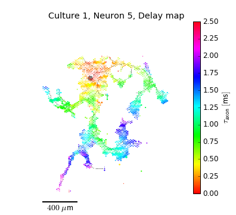

# Large-scale mapping of axonal arbors using high-density microelectrode arrays

 

This repositiory contains the source code as well as the links to the example data to replicate all [figures](publication2/README.md). 
The Hana (high density microelectrode array recording analysis) pipeline is open source, see [licence](LICENCE.md).
The example data (approx. 4 GB) consists of spike triggered averages and events that were extracted from the raw recordings.  

If you use this library in your research, please cite our paper ([Frontiers](???)):

> Bullmann T, Radivojevic M, Huber S, Deligkaris K, Hierlemann A, Frey U (2019) Large-scale mapping of axonal arbors using high-density microelectrode arrays. _Accepted_

```bib
@article {Bullmann2019b,
	author = {Torsten Bullmann, Milos Radivojevic, Stefan Huber, Kosmas Deligkaris, Andreas Reinhold Hierlemann, Urs Frey},
	title = {Large-scale mapping of axonal arbors using high-density microelectrode arrays},
	year = {2019},
	doi = {},
	URL = {},
	eprint = {},
	journal = {Frontiers in Cellular Neuroscience, section Cellular Neurophysiology}
}
```


## How to use

### Source code

Clone ```hdmea_axon``` from GitHub:

```bash
git clone http://github.com/tbullmann/hdmea_axon
```

Clone [```hana```](http://github.com/tbullmann/hana) directly into the folder ```hdmea_axon/hana```:

```bash
git clone http://github.com/tbullmann/hana hdmea_axon/hana
```

### Install requirements

Using conda to create an environment ```hdmea``` (or any other name) and install the requirements:
```bash
conda create --name hdmea python=2.7
source activate hdmea 
conda install --file hdmea_axon/hana/requirements.txt
```

### Folders and data

Create these folder/symlinks as you wish:
```bash
cd publication
mkdir temp 
mkdir figures
mkdir data
```

Download the [data from google drive](???) and copy into the data folder. For the proper folder structure see section 'Folders' below.

### Replicate the figures

For details see [description of figures](publication/README.md).

Assuming you are in ```hdmea_axon/publication```, you append your ```PYTHONPATH```, activate the environment ```hdmea``` and run the script from command line:
```bash
export PYTHONPATH=../:$PYTHONPATH     # otherwise cannot see /hana
source activate hdmea 
python all_figures.py 
```
The script takes about 10 minutes for the first run on the full data set.
If the temporary files already exist, the figures itself will take only about 3 minutes.
A total of 5 main and 1 supplementary figures can be found as ```*.png``` files in ```/figures```.

### Replicate the movies

You need to install a renderer for gif ([ImageMagick](https://www.imagemagick.org/script/download.php)) or mpeg ([ffmpeg](https://ffmpeg.org/download.html)). 

Continue by typing:
```bash
python all_animations.py
```
This script takes about 15 minutes. A total of 46 movies can be found as ```*.gif``` and/or ```*.mp4``` files in ```temp/culture1```.


## Using PyCharm

In case you are using PyCharm you have to specify the [use of the project interpreter](hdmea_env_in_pycharm.jpg) from the ```hdmea``` environment.

## Folders
Folders structure and important files:
```
.
├── hana    (Symlink or git repo)
│   └── ...
├── matlab
│   └── ... (Export function for Matlab)
├── misc           
│   └── ... (Old figures)
├── publication
│   ├── data  
│   │   ├── culture1  
│   │   └── ...
│   ├── temp   
│   │   ├── culture1  
│   │   └── ...
│   ├── figures 
│   ├── all_figures.py
│   ├── all_animations.py
│   └── ...
├── LICENCE.md
├── README.md
└── ...
```

### Acknowledgements

Kleinberg's burst detection analysis on batched data was performed using the implementation by [nmarinsek](https://github.com/nmarinsek). 
The orginal code can be found here [here](https://github.com/nmarinsek/burst_detection).